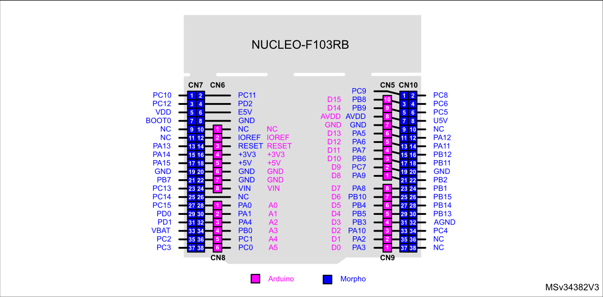

# House-Monitor

Project's goal is to create system which monitors temperature, humidity, light and pressure using STM32 microcontroller

## Components used:

- STM32F103RB microcontroller,
- DHT11 temperature and humidity sensor,
- LPS25HB temperature and pressure sensor,
- GL5616 photoresistor,
- 24AA01 EEPROM memory,
- Rotary potentiometer,
- 3 LEDs (green, blue, yellow),
- simple breadboard,
- 330 Ω and 1 kΩ resistors,
- 220 uF capacitor.

## Description

Circuit has 3 modes:
- **Gather data** - sensors measure temperature, humidity, pressure and light level, than those values are saved
on EEPROM memory. Each value is a 16-bit number, so it takes 2 bytes of
memory. Therefore, memory can store up to 64 different values at a time. If that limit gets exceeded, old values get overwritten.

- **Standby** - nothing happens, program runs in a while loop.

- **Send data** - values from EEPROM memory are read and send in an infinite loop via USB using UART.

User may alternate between above mode by rotating a potentiometer, currently chosen mode is indicated by one of the LEDs.
- **Yellow** - data gathering
- **Green** - standby
- **Blue** - data sending

## How to setup

Regarding setup, refer to NUCLEO-F103RB pinout:

- Use 3.3V to power the circuit, otherwise you might damagage ADC pins since some of them may not tolerate 5V,
- Connect yellow LED to PC1 pin, blue to PC2 and green to PC3,
- Connect DHT11's middle gold pin to PC0,
- Connect potentiometer's middle gold pin to PA1,
- Connect photoresistor to PA0,
- PB6 pin is used as SCL for I2C communication,
- PB7 pin is used as SDA for I2C communication.

For further instructions go to the circuit section.

## Circuit

### LEDs circuit:

### DHT11 and potentiometer

### I2C devices

## Additional info

### EEPROM reset

EEPROM memory is reset (set to 0) every time microcontroller gets reset

### EEPROM parts

Memory is divided into 4 parts - each dedicated to 1 parameter:
|Parameter|Begin|End|
|---|---|---|
|Light|0x00|0x1F|
|Temperature|0x20|0x3F|
|Pressure|0x40|0x5F|
|Humidity|0x60|0x7F|